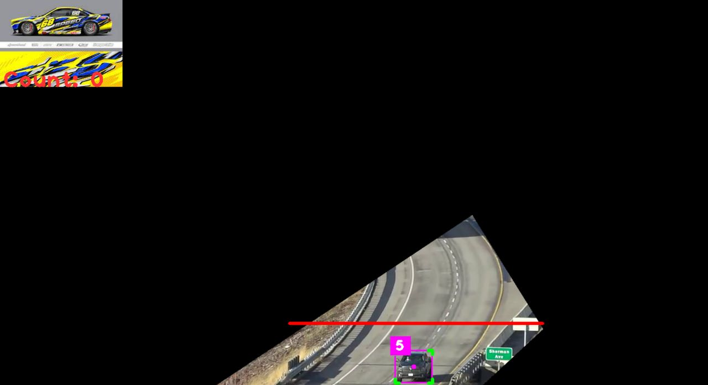

# YOLO Object Detection and Tracking

This code implements object detection and tracking using the YOLO (You Only Look Once) algorithm. It utilizes the `ultralytics` library for YOLO object detection, `cv2` for image processing, `cvzone` for graphical overlays, and the `sort` library for object tracking.

## Installation

1. Clone the repository:

   ```git clone https://github.com/your-username/your-repo.git ```
2. Install the required packages:

```pip install -r requirements.txt ```

3. Download the YOLO pre-trained weights file yolov8n.pt and place it in the Yolo-Weights directory.

4. Prepare the input data:

* WebCam: Uncomment the following lines to use the webcam as the input source:

```
cap = cv2.VideoCapture(0)
cap.set(3, 1280) # width
cap.set(4, 720) # height
```
* Video: Provide the path to your video file by setting VIDEO_PATH:
```
cap = cv2.VideoCapture(r"D:\open-cv\yolo-projects\videos\highway-curve.mp4")
```
# Usage

1. Run the script
```python carCounter.py```
2. The script will perform object detection and tracking on the input video or webcam feed.

3. Press Esc to exit the program.

# Customization
* Output Width and Height: You can customize the output frame dimensions by modifying the output_width and output_height variables.

* Mask Overlay: To add a mask overlay to the detected objects, provide the path to the mask image by setting imgMask:

```imgMask = cv2.imread(r"D:\open-cv\yolo-projects\images\mask1.png")```
* Graphics Overlay: To add a graphical overlay to the detected objects, provide the path to the overlay image by setting imgGraphics:

```imgGraphics = cv2.imread(r"D:\open-cv\yolo-projects\images\car-graphics1.png", cv2.IMREAD_UNCHANGED)```
* Detection Confidence Threshold: You can adjust the minimum confidence threshold for object detection by modifying the confidence value in the code:


```if currentClass in allowedObjects and confidence > 0.3:```
* Object Classes: The classNames list contains the names of the object classes that the model can detect. You can modify this list to include or exclude specific classes based on your requirements.

* Tracking Parameters: The Sort tracker parameters can be adjusted by modifying the max_age, min_hits, and iou_threshold values in the tracker = Sort(...) line.

# Contributing
Pull requests are welcome. For major changes, please open an issue first to discuss what you would like to change.

# License
MIT

